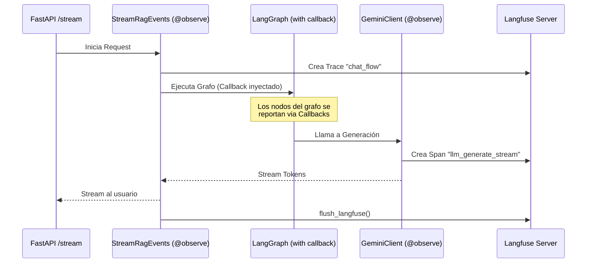

# Especificación de Implementación: Trazabilidad con Langfuse

Este documento detalla la instrumentación técnica realizada para integrar **Langfuse** en el sistema RAG, permitiendo la trazabilidad completa desde la recepción de la consulta hasta la generación de la respuesta y el uso de herramientas.

## 1. Arquitectura de Observabilidad

La solución se basa en tres pilares:
1.  **Decoradores (`@observe`)**: Para capturar la jerarquía de ejecución (Spans) de forma automática.
2.  **Callbacks**: Para la integración profunda con LangGraph y componentes de LangChain/LlamaIndex.
3.  **Flush Manual**: Para asegurar la entrega de trazas en entornos de streaming asíncrono (FastAPI).

## 2. Componentes Clave

### A. Cliente Centralizado (`src/infrastructure/observability/langfuse_client.py`)
Se implementó un wrapper `LangfuseClient` que centraliza la interacción con el SDK:
*   **Seguridad**: Si `LANGFUSE_ENABLED=false`, los decoradores se convierten en "no-op", evitando overhead o errores en entornos sin Langfuse.
*   **Singleton/Lazy**: El cliente se inicializa solo la primera vez que se requiere.
*   **Callback Handler**: Provee una función `get_langfuse_callback()` que retorna el handler oficial del SDK inyectando el contexto de la traza actual.

### B. Instrumentación de Casos de Uso (`src/application/use_cases/rag/stream_response.py`)
Es el punto de entrada de la traza principal.

```python
@observe(name="chat_flow")
async def stream_rag_events(conversation_id: uuid.UUID, ...):
    # El callback vincula LangGraph con esta traza
    cb = get_langfuse_callback()
    graph_config = {"callbacks": [cb]} if cb else {}
    
    # ... ejecución del grafo ...
    
    # Al final del stream, forzamos el envío
    flush_langfuse()
```

### C. Instrumentación de LLM Client (`src/infrastructure/llm/client.py`)
Se decoraron los métodos core de `GeminiClient` para capturar latencias, prompts y respuestas. Al estar dentro del scope de `stream_rag_events`, Langfuse los anida automáticamente como Spans hijos.

```python
@observe(name="llm_generate_stream")
async def generate_stream(self, prompt: str, **kwargs: Any):
    # La instrumentación captura el input y output del stream
    async for token in self.client.generate_stream(prompt, ...):
        yield token
```

## 3. Flujo de Datos y Jerarquía



## 4. Requerimientos de Configuración (Infrastructure)

Variables de entorno requeridas en el pod (Secret: `rag-enterprise-ai-platform-secrets`):
*   `LANGFUSE_ENABLED`: Activa/Desactiva toda la instrumentación.
*   `LANGFUSE_PUBLIC_KEY`: Key pública del proyecto.
*   `LANGFUSE_SECRET_KEY`: Key secreta para ingesta.
*   `LANGFUSE_HOST`: URL de la instancia (ej. `http://langfuse-web.langfuse.svc.cluster.local:3000`).

## 5. Consideraciones para la Spec Formal

*   **Identificación**: Se recomienda inyectar `userId` y `tags` (como el `conversation_id`) en el decorador root para facilitar el filtrado.
*   **Persistencia**: La instrumentación es "best-effort"; errores en Langfuse no deben interrumpir el flujo de chat (implementado mediante try/except en el wrapper).
*   **Asincronismo**: El uso de `flush_langfuse()` es obligatorio en funciones `async` que utilicen generadores (`yield`) para asegurar que el buffer del SDK se vacíe antes de que el worker de FastAPI cierre el scope.
