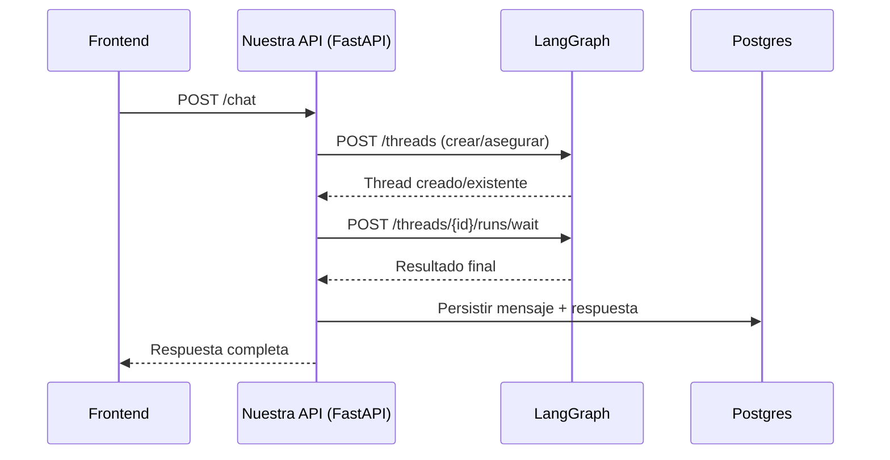
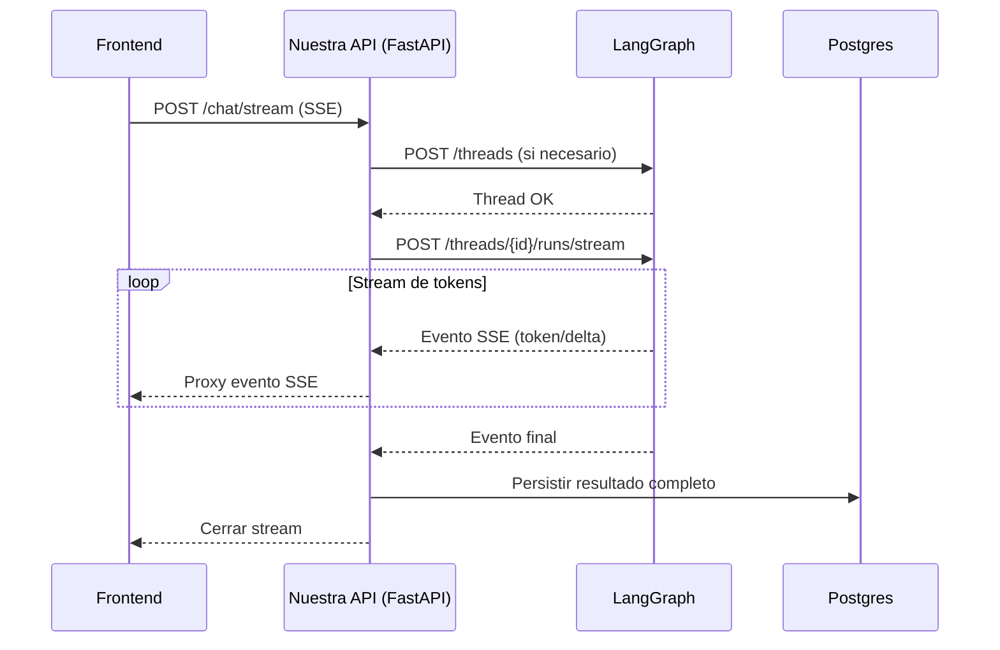

# Integración de LangGraph RAG en Enterprise AI Platform  
## Guía de Endpoints, Decisiones Arquitectónicas y Contratos Técnicos

**Propósito del documento**  
En este documento dejamos asentado, como equipo de desarrollo, **qué endpoints de LangGraph decidimos implementar**, **por qué**, y **qué decisiones arquitectónicas tomamos** para integrar LangGraph dentro de nuestra *Enterprise AI Platform*.  
El objetivo es que esta integración sea **defendible técnica y conceptualmente**, escalable y alineada con un producto enterprise (multi-tenant, auditable y extensible).

---

## 1. Enfoque general de la arquitectura

Como equipo definimos una separación clara de responsabilidades:

- **LangGraph** lo utilizamos como:
  - motor de ejecución de agentes (RAG),
  - gestor de estado del grafo (threads, runs, checkpoints),
  - proveedor de streaming y observabilidad técnica.

- **Nuestra Enterprise AI Platform (FastAPI + Postgres)** es:
  - la fuente de verdad del producto,
  - responsable de usuarios, tenants, roles y permisos,
  - responsable del modelo de conversaciones, mensajes, UX y analítica.

> [!IMPORTANT]
> **Principio rector:**  
> **LangGraph es el motor**  
> **Nuestra plataforma es el sistema de registro y gobierno del producto**

---

## 2. Endpoints de LangGraph que decidimos implementar

Organizamos los endpoints por **capas de adopción**, para justificar claramente qué usamos ahora y qué dejamos preparado para escalar.

---

## 2.1 Endpoints Core (MVP funcional)

Estos endpoints nos permiten ejecutar el RAG de forma confiable, incluso sin streaming.

| Prioridad | Módulo | Endpoint | Uso en el sistema |
|---|---|---|---|
| P0 | Threads | `POST /threads` | Crear o asegurar un thread (idempotente) |
| P0 | Thread Runs | `POST /threads/{thread_id}/runs` | Ejecutar el grafo en background |
| P0 | Thread Runs | `POST /threads/{thread_id}/runs/wait` | Ejecutar y esperar resultado final |
| P0 | Thread Runs | `GET /threads/{thread_id}/runs/{run_id}/join` | Esperar resultado de run en background |

**Decisión de implementación**  
Implementamos estos endpoints como base porque garantizan:
- consistencia,
- simplicidad,
- control total del flujo desde nuestra API.

---

## 2.2 Endpoints para Streaming (UX tipo ChatGPT)

Para mejorar la experiencia del usuario y soportar interacciones en tiempo real, incorporamos streaming.

| Prioridad | Módulo | Endpoint | Uso en el sistema |
|---|---|---|---|
| P1 | Thread Runs | `POST /threads/{thread_id}/runs/stream` | Ejecutar y recibir tokens/eventos en tiempo real |
| P1 | Thread Runs | `GET /threads/{thread_id}/runs/{run_id}/stream` | Re-conectar a un stream existente |
| P1 | Thread Runs | `GET /threads/{thread_id}/runs/{run_id}` | Consultar estado/errores de un run |

> [!NOTE]  
> El streaming se expone **siempre a través de nuestra API**, nunca directamente desde el frontend a LangGraph, para:
> - mantener control de autenticación y tenancy,
> - aplicar rate limits,
> - evitar acoplamiento directo UI ↔ runtime.

---

## 2.3 Endpoints de Observabilidad y Soporte (Enterprise-ready)

Estos endpoints nos permiten operar el sistema en producción, auditar ejecuciones y depurar errores.

| Prioridad | Módulo | Endpoint | Uso en el sistema |
|---|---|---|---|
| P2 | Threads | `GET /threads/{thread_id}` | Obtener información del thread |
| P2 | Threads | `GET /threads/{thread_id}/state` | Inspeccionar estado del grafo |
| P2 | Threads | `GET /threads/{thread_id}/history` | Historial de ejecución/checkpoints |
| P2 | Thread Runs | `GET /threads/{thread_id}/runs` | Listar runs por thread |
| P2 | Thread Runs | `POST /threads/{thread_id}/runs/{run_id}/cancel` | Cancelar ejecuciones |
| P2 | System | `GET /ok` | Health check |
| P2 | System | `GET /metrics` | Métricas Prometheus/JSON |
| P2 | System | `GET /info` | Información del servidor |

Estos endpoints son claves para:
- soporte técnico,
- debugging,
- auditoría,
- monitoreo en producción.

---

## 2.4 Endpoints de Discovery y Contratos

Los usamos para validar la integración y documentar el comportamiento del RAG.

| Prioridad | Módulo | Endpoint | Uso en el sistema |
|---|---|---|---|
| P2 | Assistants | `GET /assistants/{assistant_id}/schemas` | Contrato input/output/state |
| P2 | Assistants | `GET /assistants/{assistant_id}/graph` | Topología del grafo |

Estos endpoints nos permiten:
- verificar compatibilidad entre versiones,
- documentar el sistema,
- facilitar el onboarding de nuevos desarrolladores.

---

## 2.5 Store (Persistencia fuera del thread – opcional)

Aún no lo implementamos, pero dejamos definida su posible adopción.

| Prioridad | Módulo | Endpoint | Posible uso futuro |
|---|---|---|---|
| P3 | Store | `PUT /store/items` | Preferencias usuario/tenant |
| P3 | Store | `GET /store/items` | Recuperar configuración |
| P3 | Store | `POST /store/items/search` | Búsquedas por namespace |

**Criterio del equipo**  
Usaremos Store solo si necesitamos persistir información que:
- no depende de una conversación puntual,
- debe ser compartida entre múltiples threads.

---

## 3. Flujo de ejecución definido por el equipo

### 3.1 Flujo sin streaming (modo síncrono)



1. El frontend envía el mensaje a nuestra API.
2. Nuestra API:
   - asegura la existencia del thread,
   - ejecuta el run en LangGraph con `runs/wait`,
   - espera el resultado final.
3. Persistimos en nuestra DB:
   - mensaje del usuario,
   - respuesta final del assistant,
   - fuentes/citations.
4. Respondemos al frontend.

---

### 3.2 Flujo con streaming (modo recomendado)



1. El frontend abre una conexión de streaming con nuestra API.
2. Nuestra API:
   - crea/asegura el thread,
   - ejecuta `runs/stream` en LangGraph,
   - proxyea los eventos/token al frontend.
3. Al finalizar:
   - persistimos el resultado final en la DB,
   - cerramos el stream.

---

## 4. Decisión clave: ¿Dónde viven los chats?

### Opción A — Nuestra DB como fuente de verdad (decisión tomada ✅)
- Las conversaciones, mensajes, títulos y permisos viven en Postgres.
- LangGraph se usa solo como motor de ejecución y memoria del grafo.

### Opción B — LangGraph como fuente de verdad
- Los threads serían los "chats".
- El listado dependería de `threads/search` y metadata.

### Comparación resumida

| Criterio | DB (elegida) | LangGraph |
|---|---|---|
| Multi-tenant y permisos | ✅ Excelente | ⚠️ Riesgo por metadata |
| UX avanzada | ✅ Total | ⚠️ Limitada |
| Performance y búsqueda | ✅ Óptima | ⚠️ Dependiente del runtime |
| Lock-in | ✅ Bajo | ❌ Alto |
| Auditoría y analytics | ✅ Sólida | ⚠️ Compleja |

**Conclusión del equipo**  
Elegimos **DB como fuente de verdad** porque estamos construyendo una **plataforma enterprise**, no solo un runtime de agentes.

---

## 5. Endpoints que exponemos desde nuestra API

### Externos (frontend)
| Método | Endpoint | Descripción |
|--------|----------|-------------|
| `POST` | `/chat` | Enviar mensaje síncrono |
| `POST` | `/chat/stream` | Enviar mensaje con streaming |
| `GET` | `/conversations` | Listar conversaciones del usuario |
| `GET` | `/conversations/{id}` | Obtener conversación |
| `GET` | `/conversations/{id}/messages` | Obtener mensajes |
| `POST` | `/conversations` | Crear nueva conversación |
| `DELETE` | `/conversations/{id}` | Eliminar conversación |

### Internos (ops / soporte)
| Método | Endpoint | Descripción |
|--------|----------|-------------|
| `GET` | `/ops/rag/health` | Health check del servicio RAG |
| `GET` | `/ops/rag/metrics` | Métricas del servicio RAG |
| `GET` | `/ops/rag/threads/{thread_id}/state` | Estado del thread en LangGraph |
| `GET` | `/ops/rag/threads/{thread_id}/history` | Historial del thread |
| `GET` | `/ops/rag/runs/{run_id}` | Estado de un run |

---

## 6. Contratos de Entrada y Salida (Requests / Responses)

En esta sección documentamos explícitamente **qué datos enviamos y qué datos esperamos recibir** de cada endpoint de LangGraph que integramos en nuestra plataforma.  
Todas las llamadas se realizan de forma **asíncrona** utilizando `httpx.AsyncClient`.

---

### 6.1 POST /threads — Crear Thread

Crea un nuevo thread de LangGraph asociado a una conversación.

#### Request Body

```json
{
  "thread_id": "550e8400-e29b-41d4-a716-446655440000",
  "metadata": {
    "tenant_id": "tenant-uuid",
    "user_id": "user-uuid",
    "conversation_id": "conversation-uuid"
  },
  "if_exists": "do_nothing"
}
```

| Campo | Tipo | Requerido | Descripción |
|-------|------|-----------|-------------|
| `thread_id` | `string (uuid)` | ❌ | ID del thread. Si no se provee, LangGraph genera uno. |
| `metadata` | `object` | ❌ | Metadatos asociados al thread. |
| `if_exists` | `string` | ❌ | Comportamiento si existe: `"raise"` (error) o `"do_nothing"` (retorna existente). Default: `"raise"` |
| `ttl` | `object` | ❌ | Time-to-live: `{strategy: "delete"|"keep_latest", ttl: minutes}` |

#### Response Body (200 OK)

```json
{
  "thread_id": "550e8400-e29b-41d4-a716-446655440000",
  "created_at": "2026-01-28T10:00:00Z",
  "updated_at": "2026-01-28T10:00:00Z",
  "metadata": {
    "tenant_id": "tenant-uuid",
    "user_id": "user-uuid",
    "conversation_id": "conversation-uuid"
  },
  "status": "idle",
  "values": {},
  "interrupts": {}
}
```

| Campo | Tipo | Descripción |
|-------|------|-------------|
| `thread_id` | `string (uuid)` | ID único del thread. |
| `created_at` | `string (datetime)` | Timestamp de creación. |
| `updated_at` | `string (datetime)` | Última actualización. |
| `metadata` | `object` | Metadatos del thread. |
| `status` | `string` | Estado: `"idle"`, `"busy"`, `"interrupted"`, `"error"`. |
| `values` | `object` | Estado actual del grafo. |
| `interrupts` | `object` | Interrupciones pendientes. |

#### Códigos de Error
- `409 Conflict`: Thread ya existe (con `if_exists: "raise"`).
- `422 Validation Error`: Datos inválidos.

---

### 6.2 POST /threads/{thread_id}/runs — Ejecutar Run (Background)

Crea un run en background. Retorna inmediatamente sin esperar resultado.

#### Request Body

```json
{
  "assistant_id": "rag_generation",
  "input": {
    "messages": [
      {
        "role": "user",
        "content": "¿Cuál es la política de vacaciones?"
      }
    ]
  },
  "config": {
    "configurable": {
      "tenant_id": "tenant-uuid",
      "user_id": "user-uuid"
    }
  },
  "metadata": {
    "source": "web-chat"
  },
  "stream_mode": ["values", "messages"],
  "multitask_strategy": "enqueue"
}
```

| Campo | Tipo | Requerido | Descripción |
|-------|------|-----------|-------------|
| `assistant_id` | `string (uuid)\|string` | ✅ | ID del assistant o nombre del graph (ej: `"rag_generation"`). |
| `input` | `object\|array\|null` | ❌ | Input al grafo (típicamente `{messages: [...]}` para chat). |
| `config` | `object` | ❌ | Configuración del run con `tags`, `recursion_limit`, `configurable`. |
| `metadata` | `object` | ❌ | Metadatos del run. |
| `stream_mode` | `string[]\|string` | ❌ | Modos: `"values"`, `"messages"`, `"updates"`, `"events"`, etc. |
| `multitask_strategy` | `string` | ❌ | Estrategia concurrencia: `"reject"`, `"rollback"`, `"interrupt"`, `"enqueue"`. |
| `interrupt_before` | `string[]\|"*"` | ❌ | Nodos para interrumpir antes de ejecutar. |
| `interrupt_after` | `string[]\|"*"` | ❌ | Nodos para interrumpir después de ejecutar. |
| `webhook` | `string (uri)` | ❌ | URL para callback al terminar. |

#### Response Body (200 OK)

```json
{
  "run_id": "660e8400-e29b-41d4-a716-446655440001",
  "thread_id": "550e8400-e29b-41d4-a716-446655440000",
  "assistant_id": "770e8400-e29b-41d4-a716-446655440002",
  "created_at": "2026-01-28T10:00:05Z",
  "updated_at": "2026-01-28T10:00:05Z",
  "status": "pending",
  "metadata": {
    "source": "web-chat"
  },
  "kwargs": {},
  "multitask_strategy": "enqueue"
}
```

| Campo | Tipo | Descripción |
|-------|------|-------------|
| `run_id` | `string (uuid)` | ID único del run. |
| `thread_id` | `string (uuid)` | ID del thread asociado. |
| `assistant_id` | `string (uuid)` | ID del assistant usado. |
| `created_at` | `string (datetime)` | Timestamp de creación. |
| `updated_at` | `string (datetime)` | Última actualización. |
| `status` | `string` | Estado: `"pending"`, `"running"`, `"success"`, `"error"`, `"timeout"`, `"interrupted"`. |
| `metadata` | `object` | Metadatos del run. |
| `multitask_strategy` | `string` | Estrategia usada. |

---

### 6.3 POST /threads/{thread_id}/runs/wait — Ejecutar y Esperar

Ejecuta un run y espera el resultado final. Ideal para flujos síncronos.

#### Request Body
Mismo schema que `POST /threads/{thread_id}/runs`.

#### Response Body (200 OK)
Retorna el **estado final del grafo** (valores de salida).

```json
{
  "messages": [
    {
      "role": "user",
      "content": "¿Cuál es la política de vacaciones?"
    },
    {
      "role": "assistant",
      "content": "Según la política de la empresa, los empleados tienen derecho a 15 días hábiles de vacaciones al año...",
      "metadata": {
        "sources": [
          {
            "document": "politicas_rrhh.pdf",
            "page": 12,
            "relevance": 0.95
          }
        ]
      }
    }
  ]
}
```

---

### 6.4 POST /threads/{thread_id}/runs/stream — Ejecutar con Streaming

Ejecuta un run y recibe eventos en tiempo real via SSE.

#### Request Body
Mismo schema que `POST /threads/{thread_id}/runs`.

#### Response (200 OK — text/event-stream)

```
id: 1
event: metadata
data: {"run_id": "660e8400-e29b-41d4-a716-446655440001"}

id: 2
event: messages
data: {"role": "assistant", "content": "Según"}

id: 3
event: messages
data: {"role": "assistant", "content": " la"}

id: 4
event: messages
data: {"role": "assistant", "content": " política..."}

id: 5
event: values
data: {"messages": [...], "sources": [...]}

id: 6
event: end
data: null
```

#### Tipos de Eventos SSE

| Evento | Descripción |
|--------|-------------|
| `metadata` | Metadatos del run (run_id, etc). |
| `messages` | Tokens/chunks incrementales del mensaje. |
| `values` | Estado completo actualizado del grafo. |
| `updates` | Actualizaciones parciales de nodos. |
| `events` | Eventos internos del grafo. |
| `end` | Fin del stream. |

---

### 6.5 GET /threads/{thread_id}/runs/{run_id} — Obtener Run

Consulta el estado de un run específico.

#### Response Body (200 OK)
Mismo schema que respuesta de `POST /threads/{thread_id}/runs`.

---

### 6.6 GET /threads/{thread_id}/runs/{run_id}/join — Esperar Run

Espera a que un run en background termine y retorna el resultado.

#### Query Parameters
| Parámetro | Tipo | Descripción |
|-----------|------|-------------|
| `cancel_on_disconnect` | `boolean` | Si `true`, cancela el run si el cliente desconecta. |

#### Response Body (200 OK)
Estado final del grafo (mismo que `runs/wait`).

---

### 6.7 GET /threads/{thread_id}/runs/{run_id}/stream — Reconectar a Stream

Reconecta a un stream existente (útil para recuperación).

#### Headers
| Header | Descripción |
|--------|-------------|
| `Last-Event-ID` | ID del último evento recibido para resumir. Use `-1` para todos. |

#### Query Parameters
| Parámetro | Tipo | Descripción |
|-----------|------|-------------|
| `stream_mode` | `string` | Modo de stream a usar. |
| `cancel_on_disconnect` | `boolean` | Cancelar si desconecta. |

#### Response (200 OK — text/event-stream)
Stream de eventos SSE.

---

### 6.8 POST /threads/{thread_id}/runs/{run_id}/cancel — Cancelar Run

Cancela un run en ejecución.

#### Query Parameters
| Parámetro | Tipo | Descripción |
|-----------|------|-------------|
| `wait` | `boolean` | Si `true`, espera confirmación de cancelación. |
| `action` | `string` | `"interrupt"` (solo cancela) o `"rollback"` (cancela y elimina checkpoints). |

#### Response (200 OK)
```json
{}
```

---

### 6.9 GET /threads/{thread_id}/state — Obtener Estado del Thread

Obtiene el estado actual del grafo en el thread.

#### Query Parameters
| Parámetro | Tipo | Descripción |
|-----------|------|-------------|
| `subgraphs` | `boolean` | Incluir estados de subgrafos. |

#### Response Body (200 OK)

```json
{
  "values": {
    "messages": [...],
    "context": {...}
  },
  "next": ["generate_response"],
  "tasks": [
    {
      "id": "task-uuid",
      "name": "retrieve_documents",
      "checkpoint": {...}
    }
  ],
  "checkpoint": {
    "thread_id": "550e8400-e29b-41d4-a716-446655440000",
    "checkpoint_id": "chk-uuid",
    "checkpoint_ns": ""
  },
  "metadata": {
    "step": 3,
    "source": "update"
  },
  "created_at": "2026-01-28T10:00:10Z",
  "parent_checkpoint": null
}
```

| Campo | Tipo | Descripción |
|-------|------|-------------|
| `values` | `object\|array` | Valores actuales del estado. |
| `next` | `string[]` | Próximos nodos a ejecutar. |
| `tasks` | `object[]` | Tareas en progreso o pendientes. |
| `checkpoint` | `object` | Información del checkpoint actual. |
| `metadata` | `object` | Metadatos del estado. |
| `created_at` | `string (datetime)` | Timestamp de creación. |
| `parent_checkpoint` | `object\|null` | Checkpoint padre. |

---

### 6.10 GET /threads/{thread_id}/history — Historial del Thread

Obtiene el historial de estados/checkpoints del thread.

#### Query Parameters
| Parámetro | Tipo | Descripción |
|-----------|------|-------------|
| `limit` | `integer` | Máximo de resultados (default: 10). |
| `before` | `string` | Checkpoint ID para paginar hacia atrás. |

#### Response Body (200 OK)

```json
[
  {
    "values": {...},
    "next": [],
    "checkpoint": {...},
    "metadata": {"step": 5},
    "created_at": "2026-01-28T10:00:30Z"
  },
  {
    "values": {...},
    "next": ["generate"],
    "checkpoint": {...},
    "metadata": {"step": 4},
    "created_at": "2026-01-28T10:00:25Z"
  }
]
```

---

### 6.11 GET /threads/{thread_id}/runs — Listar Runs

Lista todos los runs de un thread.

#### Query Parameters
| Parámetro | Tipo | Descripción |
|-----------|------|-------------|
| `limit` | `integer` | Máximo de resultados (default: 10). |
| `offset` | `integer` | Offset para paginación. |
| `status` | `string` | Filtrar por status: `"pending"`, `"success"`, `"error"`, etc. |

#### Response Body (200 OK)

```json
[
  {
    "run_id": "run-uuid-1",
    "thread_id": "thread-uuid",
    "assistant_id": "assistant-uuid",
    "status": "success",
    "created_at": "2026-01-28T10:00:05Z",
    "updated_at": "2026-01-28T10:00:15Z",
    "metadata": {},
    "multitask_strategy": "enqueue"
  }
]
```

---

### 6.12 GET /assistants/{assistant_id}/schemas — Obtener Schemas

Obtiene los schemas JSON del assistant/grafo.

#### Response Body (200 OK)

```json
{
  "graph_id": "rag_generation",
  "input_schema": {
    "type": "object",
    "properties": {
      "messages": {
        "type": "array",
        "items": {...}
      }
    },
    "required": ["messages"]
  },
  "output_schema": {
    "type": "object",
    "properties": {
      "messages": {...},
      "sources": {...}
    }
  },
  "state_schema": {
    "type": "object",
    "properties": {
      "messages": {...},
      "context": {...},
      "retrieved_docs": {...}
    }
  },
  "config_schema": {
    "type": "object",
    "properties": {
      "configurable": {...}
    }
  }
}
```

---

### 6.13 GET /ok — Health Check

Verifica el estado del servidor LangGraph.

#### Query Parameters
| Parámetro | Tipo | Descripción |
|-----------|------|-------------|
| `check_db` | `integer` | `0` (no verificar DB) o `1` (verificar conectividad). |

#### Response Body (200 OK)

```json
{
  "ok": true
}
```

---

### 6.14 GET /metrics — Métricas del Sistema

Obtiene métricas del servidor.

#### Query Parameters
| Parámetro | Tipo | Descripción |
|-----------|------|-------------|
| `format` | `string` | `"prometheus"` (default) o `"json"`. |

#### Response (Prometheus — text/plain)
```
# HELP langgraph_runs_total Total number of runs
# TYPE langgraph_runs_total counter
langgraph_runs_total{status="success"} 1234
langgraph_runs_total{status="error"} 56
```

#### Response (JSON — application/json)
```json
{
  "runs_total": {
    "success": 1234,
    "error": 56
  },
  "queue_length": 5,
  "workers_active": 3
}
```

---

### 6.15 GET /info — Información del Servidor

Obtiene información de versión y features.

#### Response Body (200 OK)

```json
{
  "version": "0.1.0",
  "langgraph_py_version": "0.2.50",
  "flags": {
    "streaming": true,
    "checkpointing": true,
    "crons": true
  },
  "metadata": {
    "deployment": "cloud",
    "region": "us-east-1"
  }
}
```

---

## 7. Checklist de implementación LangGraph

### Core (P0)
- [ ] `POST /threads` — Crear thread
- [ ] `POST /threads/{thread_id}/runs` — Ejecutar run (background)
- [ ] `POST /threads/{thread_id}/runs/wait` — Ejecutar y esperar
- [ ] `GET /threads/{thread_id}/runs/{run_id}/join` — Esperar run

### Streaming (P1)
- [ ] `POST /threads/{thread_id}/runs/stream` — Stream de ejecución
- [ ] `GET /threads/{thread_id}/runs/{run_id}/stream` — Reconectar stream
- [ ] `GET /threads/{thread_id}/runs/{run_id}` — Consultar run

### Observabilidad (P2)
- [ ] `GET /ok` — Health check
- [ ] `GET /metrics` — Métricas
- [ ] `GET /info` — Info del servidor
- [ ] `GET /threads/{thread_id}` — Obtener thread
- [ ] `GET /threads/{thread_id}/state` — Estado del grafo
- [ ] `GET /threads/{thread_id}/history` — Historial
- [ ] `GET /threads/{thread_id}/runs` — Listar runs
- [ ] `POST /threads/{thread_id}/runs/{run_id}/cancel` — Cancelar run

### Discovery (P2)
- [ ] `GET /assistants/{assistant_id}/schemas` — Schemas del grafo
- [ ] `GET /assistants/{assistant_id}/graph` — Topología

### Store (P3 - Futuro)
- [ ] `PUT /store/items` — Guardar item
- [ ] `GET /store/items` — Obtener item
- [ ] `POST /store/items/search` — Buscar items

---

## 8. Conclusión técnica consensuada

Como equipo decidimos:

- **Persistir el dominio del producto** (conversaciones, mensajes, permisos, UX) en nuestra base de datos.
- **Delegar en LangGraph** la ejecución del RAG, la memoria del grafo, el streaming y la observabilidad técnica.
- **Exponer LangGraph exclusivamente a través de nuestra API**, manteniendo control de seguridad, tenancy y evolución futura.

> [!TIP]
> Esta decisión desacopla el motor de agentes del dominio del producto, reduce lock-in tecnológico y nos permite escalar la plataforma de manera controlada y auditable.

---

## 9. Referencias

- [LangGraph API Documentation](https://langchain-ai.github.io/langgraph/)
- [OpenAPI Spec: api-1.yaml](./api-1.yaml)
