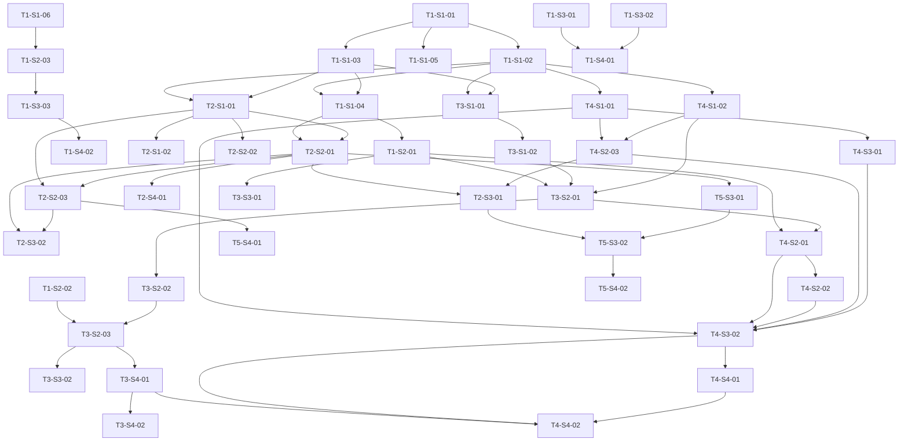

```mermaid
graph TD;
    T1-S1-01;
    T1-S1-02;
    T1-S1-03;
    T1-S1-04;
    T1-S1-05;
    T1-S1-06;
    T1-S2-01;
    T1-S2-02;
    T1-S2-03;
    T1-S3-01;
    T1-S3-02;
    T1-S3-03;
    T1-S4-01;
    T1-S4-02;
    T2-S1-01;
    T2-S1-02;
    T2-S2-01;
    T2-S2-02;
    T2-S2-03;
    T2-S3-01;
    T2-S3-02;
    T2-S4-01;
    T3-S1-01;
    T3-S1-02;
    T3-S2-01;
    T3-S2-02;
    T3-S2-03;
    T3-S3-01;
    T3-S3-02;
    T3-S4-01;
    T3-S4-02;
    T4-S1-01;
    T4-S1-02;
    T4-S2-01;
    T4-S2-02;
    T4-S2-03;
    T4-S3-01;
    T4-S3-02;
    T4-S4-01;
    T4-S4-02;
    T5-S3-01;
    T5-S3-02;
    T5-S4-01;
    T5-S4-02;
    T1-S1-01 --> T1-S1-02;
    T1-S1-01 --> T1-S1-03;
    T1-S1-01 --> T1-S1-05;
    T1-S1-02 --> T1-S1-04;
    T1-S1-02 --> T2-S1-01;
    T1-S1-02 --> T3-S1-01;
    T1-S1-02 --> T4-S1-01;
    T1-S1-02 --> T4-S1-02;
    T1-S1-03 --> T1-S1-04;
    T1-S1-03 --> T2-S1-01;
    T1-S1-03 --> T3-S1-01;
    T1-S1-04 --> T1-S2-01;
    T1-S1-04 --> T2-S2-01;
    T1-S1-06 --> T1-S2-03;
    T1-S2-01 --> T3-S2-01;
    T1-S2-01 --> T3-S3-01;
    T1-S2-01 --> T4-S2-01;
    T1-S2-02 --> T3-S2-03;
    T1-S2-03 --> T1-S3-03;
    T1-S3-01 --> T1-S4-01;
    T1-S3-02 --> T1-S4-01;
    T1-S3-03 --> T1-S4-02;
    T2-S1-01 --> T2-S1-02;
    T2-S1-01 --> T2-S2-01;
    T2-S1-01 --> T2-S2-02;
    T2-S1-01 --> T2-S2-03;
    T2-S2-01 --> T2-S2-03;
    T2-S2-01 --> T2-S3-01;
    T2-S2-01 --> T2-S3-02;
    T2-S2-01 --> T2-S4-01;
    T2-S2-01 --> T5-S3-01;
    T2-S2-03 --> T2-S3-02;
    T2-S2-03 --> T5-S4-01;
    T2-S3-01 --> T5-S3-02;
    T3-S1-01 --> T3-S1-02;
    T3-S1-02 --> T3-S2-01;
    T3-S2-01 --> T3-S2-02;
    T3-S2-01 --> T4-S2-01;
    T3-S2-02 --> T3-S2-03;
    T3-S2-03 --> T3-S3-02;
    T3-S2-03 --> T3-S4-01;
    T3-S4-01 --> T3-S4-02;
    T3-S4-01 --> T4-S4-02;
    T4-S1-01 --> T4-S2-03;
    T4-S1-01 --> T4-S3-01;
    T4-S1-01 --> T4-S3-02;
    T4-S1-02 --> T3-S2-01;
    T4-S1-02 --> T4-S2-03;
    T4-S2-01 --> T4-S2-02;
    T4-S2-01 --> T4-S3-02;
    T4-S2-02 --> T4-S3-02;
    T4-S2-03 --> T2-S3-01;
    T4-S2-03 --> T4-S3-02;
    T4-S3-01 --> T4-S3-02;
    T4-S3-02 --> T4-S4-01;
    T4-S3-02 --> T4-S4-02;
    T4-S4-01 --> T4-S4-02;
    T5-S3-01 --> T5-S3-02;
    T5-S3-02 --> T5-S4-02;
```
