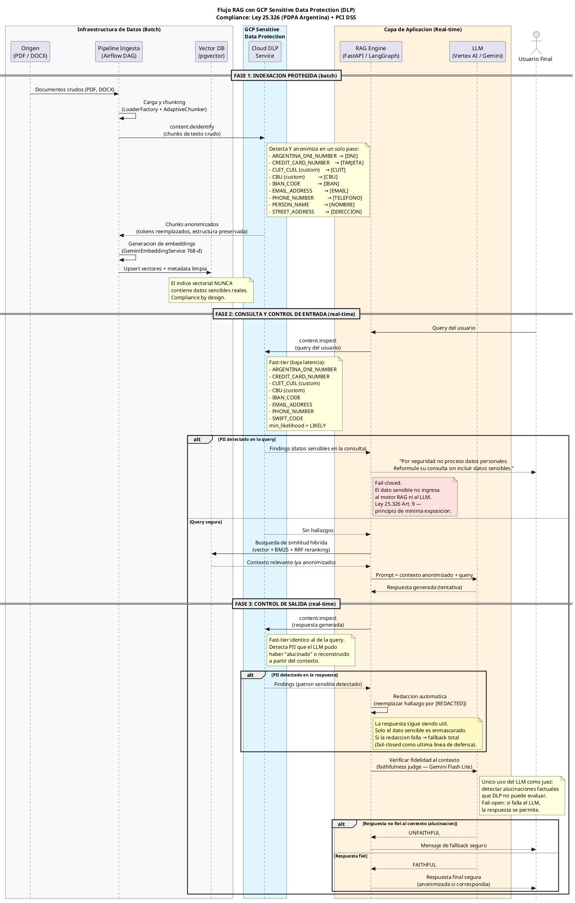

# T4-S6-02: Sanitizacion PII en recuerdos almacenados via Cloud DLP

## Meta

| Campo | Valor |
|-------|-------|
| Track | T4 (Lautaro) |
| Prioridad | Alta |
| Estado | done |
| Bloqueante para | - |
| Depende de | T4-S5-01 (done) |
| Skill | `chat-memory/SKILL.md` + `guardrails/SKILL.md` |
| Estimacion | M (2-4h) |

## Contexto

Las memorias episodicas (de T4-S5-01) pueden contener PII que los usuarios mencionan durante las conversaciones (nombres, numeros de documento, numeros de cuenta). Almacenar PII en memoria de largo plazo es un riesgo de compliance bajo la Ley 25.326 (PDPA Argentina). Las memorias deben ser sanitizadas antes del almacenamiento usando GCP Sensitive Data Protection (Cloud DLP) para garantizar deteccion de nivel enterprise, consistente con la arquitectura definida en el diagrama de secuencia UML incluido abajo.

## Spec

Implementar una capa de integracion con Cloud DLP que sanitice las memorias extraidas via `content.deidentify` antes de almacenarlas en la tabla `episodic_memories`. El cliente DLP wrappea la API de Google Cloud DLP y es reutilizable por specs futuras (T4-S9-01 para guardrails de salida).

## Criterios de Aceptacion

- [x] Cliente DLP reutilizable en `src/infrastructure/security/dlp_client.py`
- [x] Llamada a `content.deidentify` con InfoTypes argentinos configurados
- [x] InfoTypes: PERSON_NAME, PHONE_NUMBER, EMAIL_ADDRESS + custom: ARGENTINA_DNI, ARGENTINA_CUIT_CUIL, ARGENTINA_CBU
- [x] Custom InfoTypes definidos via regex en la configuracion del cliente DLP
- [x] Tokens de reemplazo semanticos: [NOMBRE], [DNI], [CUIT], [CBU], [TELEFONO], [EMAIL]
- [x] Sanitizacion ejecutada entre extraccion y almacenamiento de memorias (en `MemoryService`)
- [x] Memoria sanitizada mantiene utilidad semantica (el contexto se preserva)
- [x] Configurable: InfoTypes y tokens surrogate extensibles via diccionario
- [x] Fallback a regex local si Cloud DLP no esta disponible (resiliencia)
- [x] Setting `dlp_enabled: bool` en config para habilitar/deshabilitar
- [x] Tests unitarios con mocks de la API DLP para memorias con PII y memorias limpias
- [x] Tests del fallback regex local

## Archivos a crear/modificar

- `src/infrastructure/security/dlp_client.py` (crear — wrapper Cloud DLP reutilizable)
- `src/infrastructure/security/pii_sanitizer.py` (crear — fallback regex local)
- `src/application/services/memory_service.py` (modificar — integrar sanitizacion pre-storage)
- `src/config/settings.py` (modificar — agregar `dlp_enabled`, `dlp_min_likelihood`)
- `src/infrastructure/security/__init__.py` (modificar — exportar nuevos modulos)
- `tests/unit/test_dlp_client.py` (crear)
- `tests/unit/test_pii_sanitizer.py` (crear)
- `pyproject.toml` (modificar — agregar `google-cloud-dlp`)

## Decisiones de diseno

- **Cloud DLP como motor primario**: Usa `content.deidentify` de GCP Sensitive Data Protection. Los InfoTypes built-in (PERSON_NAME, PHONE_NUMBER, EMAIL_ADDRESS) se combinan con custom InfoTypes via regex para patrones argentinos (DNI, CUIT/CUIL, CBU).
- **Tokens surrogate**: La configuracion de deidentify usa `SurrogateType` para reemplazar cada InfoType con su token semantico (ej: `[DNI]`, `[NOMBRE]`). Esto preserva la utilidad del recuerdo.
- **Sanitizar antes de almacenar**: Una vez almacenado sin PII, no hay riesgo de fuga. Compliance by design (Ley 25.326 Art. 9).
- **Fallback regex local**: Si DLP no esta disponible (red, quota, permisos), se usa un sanitizer regex local con los mismos patrones argentinos como degradacion graceful.
- **Cliente reutilizable**: El `DLPClient` expone metodos `deidentify()` e `inspect()` que seran reutilizados por T4-S9-01 (deteccion PII en salida).
- **Auth via ADC**: Usa la misma infraestructura de credenciales del proyecto (ADC en dev, Workload Identity en GKE). No requiere service account keys adicionales.

## Diagrama UML

## Fuera de alcance

- Deteccion PII en respuestas del LLM (spec T4-S9-01 — usara `DLPClient.inspect()` de esta spec)
- Deteccion PII en queries de entrada (spec futura — usara `DLPClient.inspect()` de esta spec)
- Sanitizacion de chunks en pipeline de indexacion (spec futura — usara `DLPClient.deidentify()` de esta spec)
- Encriptacion de memorias
- GDPR delete (spec T3-S10-01)